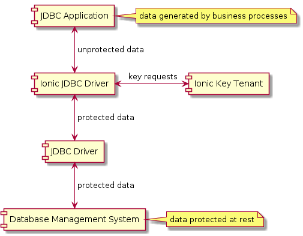

# Ionic Java SDK Sample Application / JDBC Driver

The [Ionic SDK](https://dev.ionic.com/sdk/features) provides an easy-to-use interface to the
[Ionic Platform](https://www.ionic.com/). In particular, the Ionic SDK exposes functions to perform Key Management
and Data Encryption.

This git repository contains code that demonstrates an integration of the Ionic Java SDK into a prototype Java Database 
Connectivity (JDBC) driver.  The Ionic driver implementation is intended to encapsulate a second JDBC driver, which 
provides the underlying access to popular relational database management systems.   

- [PostgreSQL JDBC driver](https://jdbc.postgresql.org/)
- [MySQL JDBC driver](https://dev.mysql.com/downloads/connector/j/)
- [Microsoft SQL Server JDBC driver](https://docs.microsoft.com/en-us/sql/connect/jdbc/overview-of-the-jdbc-driver?view=sql-server-2017)

The Ionic driver serves as a thin wrapper, performing seamless encryption and decryption on data as it is passed 
to / from the underlying database.  Sensitive data values are encrypted at rest in the database, and decrypted as they 
are included in the results of data queries.
  


Attributes may be associated with each data value on encryption.  These may also be specified in Ionic server policy 
that 
controls the release of keys needed to decrypt the value.  Ionic server policy is dynamic and composable, based on the 
needs of the data owner.

While this implementation demonstrates an integration with the PostgreSQL driver, the concept should be compatible with 
any driver that implements the 
[Java JDBC specification](https://docs.oracle.com/javase/8/docs/technotes/guides/jdbc/).

This prototype is not a full-featured product, but rather a demonstration of core Ionic software capabilities.

- It performs cryptography operations on data values serially (one at a time).
- It only provides protection of database table string fields.
- The database table schema must allocate sufficient space to accommodate the Ionic ciphertext for any data values 
designated for protection.
- The method used to configure Ionic protection is incompatible with popular object relational mapping software.
  
Many of these limitations could be addressed, given additional development effort.

## Prerequisites

- physical machine (or virtual machine) with the following software installed
  - [Git](https://git-scm.com/) distributed version control system 
  - Java Runtime Environment 7+ (either
    [OpenJDK JRE](https://openjdk.java.net/install/index.html) or
    [Oracle JRE](https://www.oracle.com/technetwork/java/javase/downloads/index.html))
  - [Apache Maven](https://maven.apache.org/) (Java software project management tool)
- a valid [Ionic Secure Enrollment Profile](https://dev.ionic.com/getting-started/create-ionic-profile) (a plaintext
json file containing access token data), in a file named *ionic.sep.plaintext.json*

The Ionic Secure Enrollment Profile contains data defining the Ionic server to use, as well as data to identify the 
client making the requests.  More details can be found [here](https://dev.ionic.com/platform/enrollment).

The instructions for obtaining an 
[Ionic Secure Enrollment Profile](https://dev.ionic.com/getting-started/create-ionic-profile) describe the 
`ionic-profiles` command line tool that is used for this purpose (given an active Ionic account).  Consult the web 
documentation for all of the options available in this tool.

During the walk-through of this demo, you will download the following:
- the PostgreSQL binary
- the git repository associated with this sample application

## JDBC Driver Interfaces

This code sample includes several classes that implement needed JDBC interfaces.

- [java.sql.Driver](https://docs.oracle.com/javase/7/docs/api/java/sql/Driver.html)
- [java.sql.Connection](https://docs.oracle.com/javase/7/docs/api/java/sql/Connection.html)
- [java.sql.PreparedStatement](https://docs.oracle.com/javase/7/docs/api/java/sql/PreparedStatement.html)
- [java.sql.Statement](https://docs.oracle.com/javase/7/docs/api/java/sql/Statement.html)
- [java.sql.ResultSet](https://docs.oracle.com/javase/7/docs/api/java/sql/ResultSet.html)

### Driver

The class [Driver](./src/main/java/com/ionic/sdk/addon/jdbc/Driver.java) implements the API to generate an 
IonicConnection.  

``` java
    public Connection connect(final String url, final Properties info) throws SQLException ...
```

In this implementation, the second API parameter (an instance of 
[java.util.Properties](https://docs.oracle.com/javase/7/docs/api/java/util/Properties.html)) is populated with an 
additional name/value pair, which specifies the path to the Ionic Secure Enrollment Profile (SEP).

### IonicConnection

The class [IonicConnection](./src/main/java/com/ionic/sdk/addon/jdbc/IonicConnection.java) embeds an instance of the 
Ionic [Agent](https://dev.ionic.com/sdk_docs/ionic_platform_sdk/java/latest/com/ionic/sdk/agent/Agent.html) 
class, which brokers Ionic key server requests and cryptography operations.  It also wraps the Connection object of the
underlying JDBC driver.  Most of the APIs are pass-through calls to the embedded PostgreSQL Connection.  The APIs 
"createStatement()" and "prepareStatement()" create additional Ionic objects, implementing the necessary interfaces and 
wrapping the native PostgreSQL objects supplied by the PostgreSQL driver.

``` java
    public Statement createStatement() throws SQLException ...
```

``` java
    public PreparedStatement prepareStatement(String sql) throws SQLException ...
```

### IonicPreparedStatement

The class [IonicPreparedStatement](./src/main/java/com/ionic/sdk/addon/jdbc/IonicPreparedStatement.java) is used to 
insert new data into the underlying database, and to update existing data in the database.  It allows the execution of 
SQL queries that accept parameters.

### IonicStatement

The class [IonicStatement](./src/main/java/com/ionic/sdk/addon/jdbc/IonicStatement.java) is used to 
read data from the underlying database.  A query typically returns one or more ResultSet objects, which are used to 
convey the results of the query from the database system to the data client.

This class may also be used to insert and update data in the backing database, using formatted SQL strings.  Use of 
this capability is discouraged, as it is subject to SQL injection attacks.

### IonicResultSet

The class [IonicResultSet](./src/main/java/com/ionic/sdk/addon/jdbc/IonicResultSet.java) is used to 
read the data from the underlying database.  It provides a row-by-row view of the data column values relevant to the 
query.

## JDBC Insert

A typical workflow to perform a database INSERT might include these steps:

1. Instantiate an instance of the class java.sql.Driver.
1. Obtain an instance of java.sql.Connection by calling an API on Driver.
1. Obtain an instance of java.sql.PreparedStatement by calling an API on Connection.
1. Populate the PreparedStatement with its parameters.
1. Execute the database update.

``` java
final Class<?> driverClass = Class.forName(driverClassName);
final Driver driver = (Driver) driverClass.newInstance();
try (Connection connection = driver.connect("my.jdbc.url"), properties)) {
    final PreparedStatement statement = connection.prepareStatement(sql);
    statement.setObject(1, "Bob");
    statement.setObject(2, "Smith");
    statement.setObject(3, "12345");
    statement.setObject(4, "Marketing");
    statement.executeUpdate();
    statement.close();
}
```

## JDBC Select

A typical workflow to perform a database SELECT might include these steps:

1. Instantiate an instance of the class java.sql.Driver.
1. Obtain an instance of java.sql.Connection by calling an API on Driver.
1. Obtain an instance of java.sql.Statement by calling an API on Connection.
1. Execute the database statement.
1. Iterate through each ResultSet.
    1. Iterate through each Row in the ResultSet.
    2. Fetch the data value corresponding to each column in the row.
    
``` java
final Class<?> driverClass = Class.forName(driverClassName);
final Driver driver = (Driver) driverClass.newInstance();
try (Connection connection = driver.connect("my.jdbc.url"), properties)) {
    final Statement statement = connection.createStatement();
    boolean moreResults = true;
    boolean isResultSet = statement.execute("SELECT * FROM personnel");
    while (moreResults) {
        moreResults = (isResultSet ? getResultSet(statement.getResultSet()) : getUpdateCount(statement));
        isResultSet = (moreResults && statement.getMoreResults());
    }
    statement.close();
}
```

## Ionic Implementation Classes

Additional classes specific to the Ionic implementation are used as containers for Ionic business logic.

### IonicColumnConfig

The class [IonicColumnConfig](./src/main/java/com/ionic/sdk/addon/jdbc/impl/IonicColumnConfig.java) is used to 
encapsulate the Ionic attributes that should be associated with values in protected table columns.

### IonicConfigReader

The class [IonicConfigReader](./src/main/java/com/ionic/sdk/addon/jdbc/impl/IonicConfigReader.java) is used to 
read the Ionic driver configuration into memory.

### IonicParameters

The class [IonicParameters](./src/main/java/com/ionic/sdk/addon/jdbc/impl/IonicParameters.java) is used to
perform protection operations on sensitive data values as they are inserted into the database.

### IonicState

The class [IonicState](./src/main/java/com/ionic/sdk/addon/jdbc/impl/IonicState.java) is used as an in-memory container 
for the settings used by the Ionic Driver.

## Sample Application Configuration

The git repository contains additional resources that configure the project to be run. 

### ionic.config.jdbc.json

The file [ionic.config.jdbc.json](./src/test/resources/ionic.config.jdbc.json) contains the specification of the 
sensitive data columns that should be Ionic protected, as well as the key attributes that should be associated with 
values in each sensitive column.

### ionic.sep.plaintext.json

The file [ionic.sep.plaintext.json](./src/test/resources/ionic.sep.plaintext.json) contains the Secure Enrollment 
Profile data used to communicate with the Ionic key server.  This project contains a template JSON SEP file, and should 
be replaced with the user's JSON.

### logging.properties

The file [logging.properties](./src/test/resources/logging.properties) contains the java logging configuration used by 
the project test classes.

### test.properties.xml

The file [test.properties.xml](./src/test/resources/test.properties.xml) contains configuration parameters used by the 
project test classes.

## Sample Application Walk-through

This git repository is set up to be compiled and run as a Maven project.  The code is tested using a set of three JUnit
tests.  Each test performs a database operation (create, read, update) on the configured database, first using the 
PostgreSQL driver, then using the Ionic driver wrapping the PostgreSQL driver.  This illustrates the code equivalence 
of the two usage cases.  The Ionic driver sample needs only a single additional property, which specifies the path of 
the Ionic Secure Enrollment Profile to be used.

Two separate databases are created in the setup script in order to illustrate the behavior differences of the two 
drivers.  Since the two table schemas are exactly the same, the tests could be modified to use the same database if 
desired.

1. Download [PostgreSQL image](https://www.enterprisedb.com/download-postgresql-binaries).  (This walk-through was
prepared using version 10.8 of the Postgres software.)

1. Inflate image into an empty folder on your filesystem.

1. Open a *Command Prompt* window.  Navigate to the root folder of the unzipped PostgreSQL instance.
   1. Run the following command to create the sample database.  (You will be prompted twice to enter/reenter a
        superuser password for the database.)
        ```shell
        bin\initdb.exe -D data -U postgres -W -E UTF8 -A scram-sha-256
        ```

        ```shell
        postgresql\pgsql>bin\initdb.exe -D data -U postgres -W -E UTF8 -A scram-sha-256
        The files belonging to this database system will be owned by user "demouser".
        This user must also own the server process.

        The database cluster will be initialized with locale "English_United States.1252".
        The default text search configuration will be set to "english".

        Data page checksums are disabled.

        Enter new superuser password:
        Enter it again:

        creating directory data ... ok
        creating subdirectories ... ok
        selecting default max_connections ... 100
        selecting default shared_buffers ... 128MB
        selecting dynamic shared memory implementation ... windows
        creating configuration files ... ok
        running bootstrap script ... ok
        performing post-bootstrap initialization ... ok
        syncing data to disk ... ok

        Success. You can now start the database server using:

            bin/pg_ctl -D data -l logfile start


        postgresql\pgsql>
        ```
   1. Run the following command to start the PostgreSQL server.
        ```shell
        bin\pg_ctl.exe -D data start
        ```
        ```shell
        postgresql\pgsql>bin\pg_ctl.exe -D data start
        waiting for server to start....
        listening on IPv4 address "127.0.0.1", port 5432
        listening on IPv6 address "::1", port 5432
        ...
        database system is ready to accept connections
         done
        server started

        postgresql\pgsql>
        ```

1. Open a second *Command Prompt* window.  Navigate to the root folder of the unzipped PostgreSQL instance.
   1. Run the following command to enter the PSQL command console.
        ```shell
        bin\psql.exe -U postgres
        ```
        ```shell
        postgresql\pgsql>bin\psql.exe -U postgres
        Password for user postgres:
        psql (10.8)
        WARNING: Console code page (437) differs from Windows code page (1252)
                 8-bit characters might not work correctly. See psql reference
                 page "Notes for Windows users" for details.
        Type "help" for help.

        postgres=#
        ```

   1. Check the PostgreSQL version (this also verifies connectivity to the server process).
        ```shell
        postgres=# SELECT version();
                             version
        ------------------------------------------------------------
        PostgreSQL 10.8, compiled by Visual C++ build 1800, 64-bit
        (1 row)

        postgres=#
        ```

   1. Create the sample tables in the database by performing a copy/paste operation from the sample resource
   *sql.sample.setup.txt* into the Command Prompt window.  Create each table in a separate PSQL operation.
        ```shell
        postgres=# CREATE TABLE personnel(
        postgres=# id serial PRIMARY KEY,
        postgres=# first VARCHAR (64),
        postgres=# last VARCHAR (64),
        postgres=# zip VARCHAR (64),
        postgres=# department VARCHAR (64));
        CREATE TABLE
        postgres=#
        ```

        ```shell
        postgres=# CREATE TABLE personnelinsecure(
        postgres=# id serial PRIMARY KEY,
        postgres=# first VARCHAR (64),
        postgres=# last VARCHAR (64),
        postgres=# zip VARCHAR (64),
        postgres=# department VARCHAR (64));
        CREATE TABLE
        postgres=#
        ```

1. Open a third *Command Prompt* window.  Clone the git sample application repository into an empty folder on your
filesystem.
    ```shell
    git clone https://github.com/IonicDev/sample-jdbc-driver.git
    ```

1. Substitute the JSON text of your Ionic Secure Enrollment Profile into the file
    **[./src/test/resources/ionic.sep.plaintext.json]**.

1. Navigate to the root folder of the git repository. Run the following command to package the
sample application (which will also execute the sample's unit tests):

    ```shell
    mvn clean package
    ```
    ```shell
    sample-jdbc-driver>mvn clean package
    [INFO] ------------------------------------------------------------------------
    [INFO] Building Ionic Java SDK Sample, JDBC Driver 0.0.1
    [INFO] ------------------------------------------------------------------------
    ...
    [INFO] -------------------------------------------------------
    [INFO]  T E S T S
    [INFO] -------------------------------------------------------
    [INFO] Running com.ionic.sdk.addon.jdbc.test.DriverCreateTest
    INFO com.ionic.sdk.addon.jdbc.test.DriverCreateTest doDriver org.postgresql.jdbc.PgConnection
    INFO com.ionic.sdk.addon.jdbc.test.DriverCreateTest doDriver ROWS = 1
    INFO com.ionic.sdk.addon.jdbc.test.DriverCreateTest doDriverAlternate org.postgresql.jdbc.PgConnection
    INFO com.ionic.sdk.addon.jdbc.test.DriverCreateTest doDriverAlternate [EXCEPTION EXPECTED] message: Can't use query methods that take a query string on a PreparedStatement.
    INFO com.ionic.sdk.addon.jdbc.test.DriverCreateTest doDriver com.ionic.sdk.addon.jdbc.IonicConnection
    INFO com.ionic.sdk.addon.jdbc.test.DriverCreateTest doDriver ROWS = 1
    INFO com.ionic.sdk.addon.jdbc.test.DriverCreateTest doDriverAlternate com.ionic.sdk.addon.jdbc.IonicConnection
    INFO com.ionic.sdk.addon.jdbc.test.DriverCreateTest doDriverAlternate [EXCEPTION EXPECTED] message: Can't use query methods that take a query string on a PreparedStatement.
    [INFO] Tests run: 2, Failures: 0, Errors: 0, Skipped: 0, Time elapsed: 1.485 s - in com.ionic.sdk.addon.jdbc.test.DriverCreateTest
    [INFO] Running com.ionic.sdk.addon.jdbc.test.DriverReadTest
    INFO com.ionic.sdk.addon.jdbc.test.DriverReadTest doDriver org.postgresql.jdbc.PgConnection
    INFO com.ionic.sdk.addon.jdbc.test.DriverReadTest getResultSet [107, ~!2!D7GH9Z5F59g!xS9BDskxLi1l0VZ/ZnMbWR4reQ6ucg!, ~!2!D7GH9R5H53E!2xj2vJ/MS5uRyv/g491+2NvCBHWIqzY!, ~!2!D7GH9J5B5oo!6XR7OpQqldoQ2hMdMTBSIEfo2g7t!, Engineering]
    INFO com.ionic.sdk.addon.jdbc.test.DriverReadTest doDriver com.ionic.sdk.addon.jdbc.IonicConnection
    INFO com.ionic.sdk.addon.jdbc.test.DriverReadTest getResultSet [107, Thomas, Jackson, 12147, Engineering]
    [INFO] Tests run: 2, Failures: 0, Errors: 0, Skipped: 0, Time elapsed: 0.339 s - in com.ionic.sdk.addon.jdbc.test.DriverReadTest
    [INFO] Running com.ionic.sdk.addon.jdbc.test.DriverUpdateTest
    INFO com.ionic.sdk.addon.jdbc.test.DriverUpdateTest doDriver org.postgresql.jdbc.PgConnection
    INFO com.ionic.sdk.addon.jdbc.test.DriverUpdateTest doDriver ROWS = 1
    INFO com.ionic.sdk.addon.jdbc.test.DriverUpdateTest doDriver com.ionic.sdk.addon.jdbc.IonicConnection
    INFO com.ionic.sdk.addon.jdbc.test.DriverUpdateTest doDriver ROWS = 1
    [INFO] Tests run: 2, Failures: 0, Errors: 0, Skipped: 0, Time elapsed: 0.403 s - in com.ionic.sdk.addon.jdbc.test.DriverUpdateTest
    ...
    [INFO] ------------------------------------------------------------------------
    [INFO] BUILD SUCCESS
    [INFO] ------------------------------------------------------------------------
    
    sample-jdbc-driver>
    ```

The test case DriverCreateTest inserts one record into each database table.  The PostgreSQL driver creates an 
unprotected record in the table "PersonnelInsecure".  The Ionic driver wrapper creates a record with protected fields 
in the table "Personnel".

The test case DriverReadTest reads all records from the table "Personnel", using the 
PostgreSQL driver and the Ionic driver wrapper, respectively.  On use of the PostgreSQL driver, the protected values 
are returned to the data client.  On use of the Ionic driver, the unprotected values are returned to the data client.

The test case DriverUpdateTest inserts a new record, and then updates the value of the field "Last", adding a trailing 
"2".  Using the Ionic driver, this results in the creation and use of a new cryptography key to protect the updated 
value.  (In general, Ionic keys are used for a single data value encryption.)

## Analysis

The implementation performs in-place encryption on distinct data columns, based on configuration.  The database columns
must be large enough to accommodate the Ionic ciphertext associated with the column data.  At present, only VARCHAR 
columns may be designated for Ionic protection.  The implementation intends to pass through any column types other than 
VARCHAR without alteration.  Support of alternate database schemas may be considered in the context of a production 
implementation.

The implementation performs cryptography operations on data elements singly.  It will perform poorly when fetches are 
performed on large data sets.  A future enhancement opportunity is to fetch ResultSet data in batches, and to perform 
cryptography operations on all of the Ionic-protected elements at once.  This will require SDK enhancements, or a 
custom KeyServices implementation, as the ChunkCipher API does not expose methods to perform batch operations (neither 
encryption nor decryption).

The implementation has a goal of adhering to standard method of instantiating "java.sql.Driver" instances, with 
additional Ionic configuration options.  This is expressed in the implementation unit tests, which intend to 
demonstrate the ease of switching out the Ionic driver layer.

Objects supplied by the underlying Driver are wrapped by Ionic implementations, which perform pass through cryptography
operations as appropriate.  When no Ionic operation is relevant to an API call, the corresponding wrapped object API is 
called.

The implementation needs a way to mark table columns as sensitive (such that Ionic protection should be applied on 
write).  There seems to be no cross-platform interface for doing this.  Additionally, there seems to be no Java SQL 
interface for mapping PreparedStatement parameters to their intended database write table columns.  The solution of 
embedding this information in a configuration file is brittle, and does not map well to object-relational mapping (ORM)
libraries.  This is an opportunity for future enhancement of this prototype.

The implementation uses a JSON configuration file to express the Ionic protection options associated with particular 
database write statements.  A future enhancement opportunity would involve streamlining this.  Ionic-protected elements 
(on database writes) could be denoted using some alternative to the SQL standard question mark.  Example: 
- INSERT INTO personnel (first, last, zip, department) VALUES (?, ?, ?, ?)
- INSERT INTO personnel (first, last, zip, department) VALUES (?IonicFirst, ?IonicLast, ?IonicZip, ?)

Element names could be references to some other part of the configuration where key attributes could be specified.

A [previous sample application](https://github.com/IonicDev/sample-jdbc-1/tree/master/waypoint-3-policy) demonstrated 
the ability to alter the view of protected data via programmatic manipulation of the active Ionic key server policy 
set.  Key fetch failures may be handled in several ways.  It might sometimes be beneficial to allow a workflow where 
sensitive data is allowed to traverse a non-sensitive area in its opaque representation (as a ciphertext string), on 
its way to a sensitive destination, where the data may be read.

## Conclusion

The concept of an Ionic JDBC overlay driver is quite seductive.  This prototype has many limitations, and significant 
effort would be needed to address those limitations.  Still, it points the way toward a future where data protection 
may be seamlessly incorporated into structured data management applications, and where good data governance is simple, 
expected, and universal.


